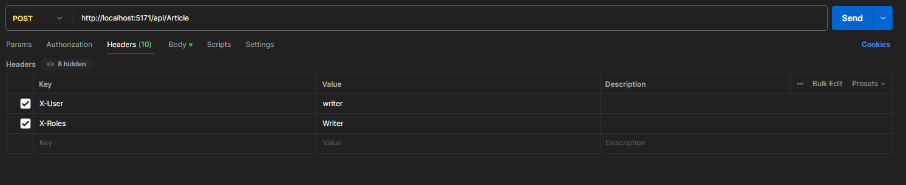

# Authorization start

Starter project for authorization workshop.

## Getting started

```sh
dotnet run
```

Input the following into postman:
```
http://localhost:5171/api/Article
```
Create the following key and values, in the header section:    
CASE SENSITIVE - Has to be EXACT match.     
Like this:  
     
Note: This is a POST method.    
key: ``X-User`` value: ``writer``   
key: ``X-Roles`` value: ``Writer``      

Then do the same for editor.    
key: ``X-User`` value: ``editor``   
key: ``X-Roles`` value: ``Editor``
    
Then do the same for subscriber.    
key: ``X-User`` value: ``subscriber``   
key: ``X-Roles`` value: ``Subscriber``  

Then do the same for the comment creation:  
Endpoint: ``http://localhost:5171/api/Comment``     
This is also a POST method.
    
### Test the following endpoints    
``http://localhost:5171/api/Article/
``
``http://localhost:5171/api/Comment/
``

For PUT and DELETE methods.

Remember to change the KEY and VALUE accordingly.   
To "target" a specific article or comment you need to add a number, id of the item, at the end of the url.  
``http://localhost:5171/api/Article/2
``
    
For instance.